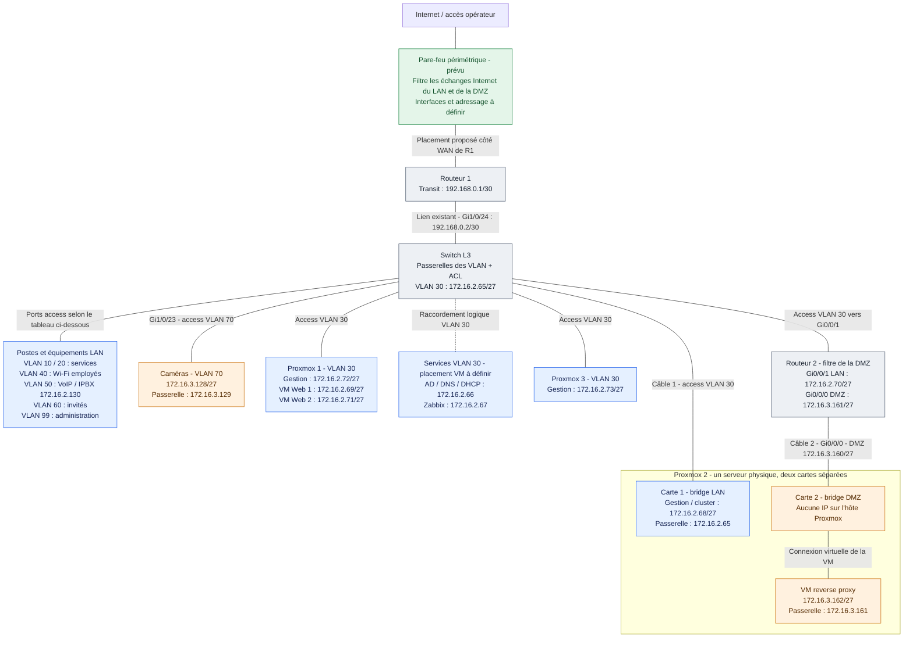

# Comprendre le réseau

Le **switch L3** porte les passerelles des VLAN et filtre les accès des clients. **R2** relie le VLAN 30 à la DMZ du proxy et limite ce que le proxy peut joindre.

## Schéma de l'infrastructure

- Les quatre liaisons VLAN 30 (trois Proxmox et R2) utilisent **Gi1/0/9 à Gi1/0/12**, ordre à confirmer. Les trois nœuds échangent par le switch pour le cluster.
- Les deux cartes de Proxmox 2 restent séparées : **aucun lien entre les bridges LAN et DMZ**. Le proxy n'a qu'une carte virtuelle, côté DMZ. Les câbles sont non tagués, sans trunk.
- DNS/DHCP `.66` et Zabbix `.67` sont également prévus dans le VLAN 30 ; leur placement sur les hôtes reste à définir. Les Web et ces services utilisent la passerelle `.65`.
- Le bloc DMZ `172.16.3.128/26` contient les caméras `.128/27` et le proxy `.160/27`. La réserve LAN `172.16.2.192/27` n'a aucun VLAN.
- La HA du cluster reste à configurer et tester. Le proxy est unique sur Proxmox 2 : sa panne interrompt l'accès aux sites via le proxy.

## Où placer le pare-feu ?

**Base retenue pour la maquette : un pare-feu côté Internet de R1**, avec les ACL du switch et de R2. Le pare-feu est un ajout prévu au schéma, pas un équipement déjà configuré. Son modèle, ses interfaces, ses adresses, ses routes et les éventuelles règles NAT restent à définir. Le lien R1–switch existant est conservé.

| Trajet | Filtrage prévu |
|---|---|
| Internet ↔ LAN | Pare-feu côté R1 |
| Internet ↔ DMZ | Même pare-feu ; accès et routes à configurer si publication des sites |
| DMZ proxy ↔ serveurs LAN | ACL de R2 et, selon le trajet, ACL du switch ; ce trafic ne traverse pas le pare-feu côté R1 |
| Entre VLAN du switch | ACL du switch L3 |

La DMZ a donc aussi besoin d'un filtre. Pour cette base pédagogique, R2 conserve son ACL : ajouter un second appareil n'est pas indispensable à la démonstration. Pour un suivi réel des connexions entre DMZ et LAN, prévoir ensuite un pare-feu à cette frontière, une fonction équivalente sur R2 si disponible, ou revoir le câblage pour faire passer la DMZ par une interface dédiée du même pare-feu. Un pare-feu unique peut gérer plusieurs zones seulement si les flux concernés le traversent.

Les ACL actuelles de R2 autorisent les réponses du proxy vers le LAN uniquement : **la publication Internet n'est pas opérationnelle avec ces seuls fichiers**. Les règles de retour vers Internet, le DNS et les mises à jour du proxy feront partie d'une étape dédiée.

Référence : [Cisco — pare-feu par zones et suivi des connexions](https://www.cisco.com/c/en/us/support/docs/security/ios-firewall/98628-zone-design-guide.html).

## Le trajet d'une page web

1. Le PC du VLAN 10 demande le site au proxy `172.16.3.162` en HTTP/HTTPS : PC → switch → R2 → proxy.
2. Le proxy ouvre une deuxième connexion vers Web 1 `.69` ou Web 2 `.71` : proxy → R2 → serveur web, via les ports VLAN 30 du switch.
3. Le serveur web répond via sa passerelle `.65`, puis R2. L'ACL VLAN 30 autorise ces réponses avant les interdictions.
4. Le proxy renvoie la page au PC : proxy → R2 → switch → PC.

Les utilisateurs ne joignent pas directement les Web. Le proxy choisit le serveur selon sa configuration applicative. Le DNS du site doit pointer vers l'adresse du proxy.

## Ports du switch

| Ports | Affectation |
|---|---|
| Gi1/0/1–4 | Access VLAN 10 |
| Gi1/0/5–8 | Access VLAN 20 |
| Gi1/0/9–12 | Access VLAN 30 : Proxmox 1, 2, 3 et Routeur 2, ordre **à confirmer** |
| Gi1/0/13–16 | Access VLAN 40 |
| Gi1/0/17–20 | Access VLAN 50 VoIP |
| Gi1/0/21 | Access VLAN 99 |
| Gi1/0/22 | Access VLAN 60 |
| Gi1/0/23 | Access VLAN 70 caméras |
| Gi1/0/24 | Lien Routeur 1 conservé |

Routeur 2 **Gi0/0/1** rejoint un port VLAN 30 du switch. **Gi0/0/0** rejoint directement la deuxième carte de Proxmox 2. Tous ces câbles sont non tagués, sans trunk.

## Les trois Proxmox

Les nœuds `.72`, `.68` et `.73` sont dans le VLAN 30. Web 1 et Web 2 démarrent sur Proxmox 1.

Proxmox 2 possède deux cartes : carte LAN vers le switch (gestion `.68`, passerelle `.65`) et carte DMZ vers R2. Chaque carte a son propre bridge. Le bridge DMZ n'a aucune IP sur l'hôte ; seule la VM proxy porte `.162`, passerelle `172.16.3.161`. Aucun pont ni routage entre les deux bridges.

La haute disponibilité reste à mettre en place : stockage partagé ou réplication, quorum et bascule. Le proxy ne peut pas migrer automatiquement vers un nœud sans accès à son réseau DMZ.

## Lire les ACL

Une ACL se lit de haut en bas : première règle correspondante appliquée. `in` filtre les paquets arrivant par l'interface. Les échanges entre deux machines du VLAN 30 restent locaux et échappent à l'ACL de sa passerelle.

| Écriture | Sens |
|---|---|
| `host .162` | Une seule adresse (les commandes utilisent l'IP complète) |
| `any eq 443` | Destination quelconque, port destination 443 |
| `host .69 eq 443` avant la destination | Web 1, port source 443 : une réponse HTTPS |
| `established` | TCP avec ACK ou RST ; sert aux retours, sans vérifier l'existence d'une session |
| `echo-reply` | Réponse à un ping |
| `deny ip any any log` | Refuser le reste et journaliser |

## Tableau des ACL par VLAN

Les colonnes décrivent les paquets qui partent du VLAN vers sa passerelle. Une réponse est aussi un paquet : elle doit être autorisée dans le sens retour.

| VLAN / zone | Où se trouve l'ACL ? | Autorisé | Bloqué |
|---|---|---|---|
| 10 — Service 1 | Switch, `Vlan10 in` : `ACL_VLAN10` | DNS/DHCP vers `.66` ; VLAN 20/40 ; proxy 80/443 ; autres destinations non refusées | VLAN 30 hors DNS/DHCP, VLAN 50/60/99 et DMZ hors proxy web |
| 20 — Service 2 | Switch, `Vlan20 in` : `ACL_VLAN20` | DNS/DHCP vers `.66` ; VLAN 10/40 ; proxy 80/443 ; autres destinations non refusées | VLAN 30 hors DNS/DHCP, VLAN 50/60/99 et DMZ hors proxy web |
| 30 — Serveurs | Switch, `Vlan30 in` : `ACL_VLAN30` | Retours DNS/DHCP, administration, Zabbix et proxy ; Web 1/2 répondent au proxy ; sorties externes 80/443 et NTP 123 ; DNS externe depuis `.66` | Autres flux vers les réseaux privés ; autres sorties routées |
| 40 — Wi-Fi employés | Switch, `Vlan40 in` : `ACL_WIFI_EMPLOYES` | DNS/DHCP vers `.66` ; VLAN 10/20 ; proxy 80/443 ; autres destinations non refusées | VLAN 30 hors DNS/DHCP, VLAN 50/60/99 et DMZ hors proxy web |
| 50 — VoIP | Switch, `Vlan50 in` : `ACL_VLAN50` | DHCP, DNS UDP vers `.66` ; IPBX local `.130` ; autres destinations non refusées | Autres accès LAN/DMZ |
| 60 — Invités | Switch, `Vlan60 in` : `ACL_WIFI_INVITES` | DHCP ; DNS TCP/UDP ; proxy 80/443 ; autres destinations non refusées | Autres accès LAN/DMZ (les exceptions DNS sont prioritaires) |
| 70 — Caméras | Switch, `Vlan70 in` : `ACL_VLAN70` | DNS UDP vers `.66` ; Zabbix TCP 10051 vers `.67` ; réponses TCP/ping aux administrateurs | Tout le reste |
| 99 — Administration | Switch, `Vlan99 in` : `ACL_VLAN99` | Tout trafic IP provenant du VLAN 99, sous réserve des filtres du trajet et des retours | Sources extérieures au VLAN 99 sur cette interface |
| DMZ proxy — zone 71 | R2, `Gi0/0/0 in` : `DMZ_VERS_LAN` | Proxy `.162` vers Web `.69`/`.71` sur 80/443 ; réponses web aux clients ; réponses SSH/ping aux administrateurs | Tout le reste, dont DNS et mises à jour du proxy pour cette base |
| SSH des équipements | Switch et R2, lignes VTY : `SSH_VLAN99` | Connexions SSH depuis le VLAN 99 | SSH depuis les autres réseaux |

Pour les VLAN 10/20/40/50/60, la dernière permission reste générale après les refus listés : elle ne garantit pas le blocage de tous les réseaux privés possibles. Les échanges locaux du VLAN 30 et les téléphones vers leur IPBX local ne passent pas par les ACL des passerelles.

Exemple de retour : le proxy contacte Web 1 sur le port **destination** 443. Web 1 répond depuis son port **source** 443 vers le port temporaire choisi par le proxy. C'est pourquoi le retour utilise `host 172.16.2.69 eq 443 host 172.16.3.162 established`. Le mot `established` vérifie ACK/RST ; il ne mémorise aucune connexion.

R2 garde **une seule ACL de trafic**, en entrée DMZ, et une ACL distincte pour protéger son SSH. La seconde ACL de trafic côté LAN a été retirée : les VLAN clients sont déjà filtrés sur le switch. Le VLAN 99 peut envoyer librement vers la DMZ, mais seuls les retours prévus passent le filtre DMZ.

Pour cette base, AD hors DNS/DHCP, supervision par interrogation, DNS et mises à jour du proxy restent à définir. Les sorties autorisées par port ne sont pas limitées à des sites précis. R1 garde la responsabilité des accès Internet ; son NAT et ses filtres ne sont pas configurés ici.

## Remplacer une ancienne configuration

Ces fichiers décrivent la configuration cible. Sur la maquette, sauvegarder avant modification, utiliser la console et remplacer `A_REMPLACER`.

- Remplacer entièrement les ACL modifiées ; coller des règles après un ancien `permit` ou `deny` final ne suffit pas. Détacher l'ACL, supprimer sa définition, recréer la version cible puis la réappliquer, pendant une interruption de la maquette.
- Sur R2, retirer l'ancien filtre LAN avec `interface GigabitEthernet0/0/1`, `no ip access-group LAN_VERS_DMZ in`, `exit`, puis `no ip access-list extended LAN_VERS_DMZ` en mode configuration. Conserver le filtre DMZ.
- Si une ancienne SVI 71 existe sur le switch, la retirer : seule R2 porte la passerelle du proxy. Le VLAN 80 n'est pas utilisé ; `.192/27` reste en réserve.
- Le lien R1 reste `192.168.0.2/30` vers `.1`. R1 doit connaître les routes de retour LAN/DMZ via `.2` ; à coordonner avec son responsable.

[Plan d'adressage](../README.md) · [Vérifications sur la maquette](Audit_Site_C.md)
