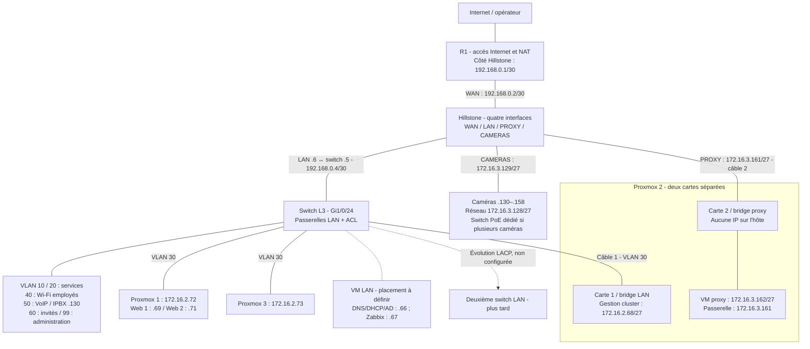

# Infrastructure — schéma et fonctionnement

**R1 = accès Internet ; Hillstone = filtrage entre WAN, LAN, proxy et caméras ; switch L3 = VLAN et routage interne.** Un seul pare-feu avec quatre interfaces physiques. Aucun R2, aucun VLAN caméra/proxy sur le switch.

## Schéma de l'infrastructure

Les trois Proxmox communiquent dans le VLAN 30, passerelle `.65`. Les deux bridges de Proxmox 2 ne sont jamais reliés ; sa VM proxy utilise uniquement la carte DMZ. Le switch PoE caméra éventuel est distinct du futur deuxième switch LAN. Les zones du Hillstone sont des réseaux sur interfaces dédiées, sans trunk.

## Câblage du premier switch

| Ports | Connexion |
|---|---|
| Gi1/0/1–4 | VLAN 10 |
| Gi1/0/5–8 | VLAN 20 |
| Gi1/0/9–12 | VLAN 30 : trois Proxmox, ordre à confirmer ; un port disponible |
| Gi1/0/13–16 | VLAN 40 |
| Gi1/0/17–20 | VLAN 50 |
| Gi1/0/21 | VLAN 99 : administrateur |
| Gi1/0/22 | VLAN 60 |
| Gi1/0/23 | Réserve, désactivé ; plus de caméra |
| Gi1/0/24 | Port routé vers Hillstone LAN, 192.168.0.5/30 |

## Routes et trajet web

| Équipement | Routes nécessaires |
|---|---|
| Switch | Défaut vers Hillstone 192.168.0.6 |
| Hillstone | LAN 172.16.2.0/24 via switch .5 ; défaut vers R1 .1 ; proxy/caméras connectés directement |
| R1 | LAN, DMZ et transit switch via Hillstone .2 ; défaut vers opérateur |

PC → switch → Hillstone → proxy ; puis proxy → Hillstone → switch → Web 1/2. Les réponses reprennent le chemin inverse. Le DNS interne du site doit pointer sur le proxy `.162`.

Toutes les communications proxy/caméras/LAN/Internet passent par le Hillstone. **Les échanges entre VLAN LAN restent sur le switch** : ses ACL sont nécessaires. Les échanges dans un même VLAN échappent aux ACL des passerelles et demandent, si nécessaire, des pare-feu locaux.

## Tableau des accès

| VLAN / zone | Autorisé | Refusé |
|---|---|---|
| 10 | DHCP/DNS `.66`, VLAN 20/40, proxy 80/443, Internet web/NTP | Autres destinations privées et autres sorties |
| 20 | DHCP/DNS `.66`, VLAN 10/40, proxy 80/443, Internet web/NTP | Autres destinations privées et autres sorties |
| 30 | Retours DNS/DHCP/admin/Zabbix, Web 1/2 vers proxy en réponse ; Internet web/NTP ; DNS externe depuis `.66` | Autres flux routés privés et autres sorties |
| 40 | DHCP/DNS `.66`, VLAN 10/20, proxy 80/443, Internet web/NTP | Autres destinations privées et autres sorties |
| 50 | DHCP/DNS `.66`, IPBX local `.130`, Internet web/NTP | Autres accès privés ; SIP opérateur non configuré |
| 60 | DHCP/DNS `.66`, proxy 80/443, Internet web/NTP | Autres accès privés et DNS externe direct |
| 99 | Administration LAN ; proxy SSH/ping/web, caméras SSH/ping/web ; gestion Hillstone HTTPS/SSH | Les politiques Hillstone limitent les services hors LAN |
| Proxy — Hillstone | Web 1/2 sur 80/443 ; réponses des sessions autorisées | Autres nouvelles connexions |
| Caméras — Hillstone | DNS `.66`, Zabbix actif `.67` TCP 10051, réponses à l'administration | Proxy, Internet et autres nouvelles connexions LAN |
| Internet — Hillstone | Réponses des sessions sortantes autorisées | Nouvelles connexions vers les réseaux internes |

Web = TCP 80/443 ; NTP = UDP 123. Les plages privées sont bloquées avant les sorties Internet, sauf exceptions. Le Hillstone suit les sessions ; les ACL Cisco gardent `established` seulement pour les retours traversant les SVI LAN. Ce mot vérifie ACK/RST sans mémoriser la connexion. Les anciennes règles de retour du proxy dans ACL_VLAN30 ont disparu : le proxy arrive désormais sur Gi1/0/24.

## Configuration et migration

[Switch L3](../configuration/Switch-L3.txt) · [Hillstone et routes R1](../configuration/Pare-feu-Hillstone.md) · [Recette](Audit_Site_C.md).

Depuis la console, sauvegarder avant changement et prévoir l'interruption de la maquette. Vérifier que le nouveau transit `192.168.0.4/30` est libre.

1. Retirer le câble R1–switch ; raccorder R1 au WAN Hillstone. Le switch abandonne `192.168.0.2`, que reprend le pare-feu.
2. Relier Gi1/0/24 au LAN Hillstone ; appliquer `.5/30` sur le switch, `.6/30` sur le pare-feu.
3. Retirer l'ancien lien pare-feu–VLAN 30. Supprimer sur le switch l'ancienne route `172.16.3.160/27 via 172.16.2.70` et la route par défaut via `192.168.0.1` ; appliquer la nouvelle route par défaut via `.6`.
4. Déplacer les caméras vers le port CAMERAS. Supprimer l'ancienne SVI 70 (`no interface Vlan70`), son ACL (`no ip access-list extended ACL_VLAN70`) et le VLAN (`no vlan 70`). Désactiver Gi1/0/23 et le remettre dans VLAN 1, comme dans la cible. Aucun doublon de passerelle `.129`.
5. Remplacer entièrement les ACL modifiées, les réappliquer et saisir les quatre zones/politiques Hillstone. Supprimer ses anciennes adresses LAN `.70` et route par défaut via `.65`, puis appliquer ses nouvelles routes.
6. Préparer les routes R1 et le NAT Internet avec son responsable. Valider les tests, puis sauvegarder.

La configuration WAN opérateur de R1 n'est pas fournie : l'accès Internet reste à finaliser sur ce routeur. Les PDF sont des sources historiques ; les fichiers présents décrivent la nouvelle cible. AD complet, publication publique, DNS/mises à jour du proxy et protocole réel des caméras restent à définir.

## Évolutions prévues

- **Deuxième switch LAN + EtherChannel LACP** : sélectionner deux ports compatibles et un trunk limité aux VLAN utiles. Gi1/0/23 est réservé, un port VLAN 30 peut être réaffecté si libre. Aucun Port-channel n'est configuré aujourd'hui. LACP tolère une panne de lien, pas celle du switch qui porte les passerelles.
- **HA Proxmox** : stockage partagé/réplication, quorum et bascule à valider. Le proxy reste unique sur Proxmox 2 ; sa panne rend les sites inaccessibles via le proxy.

[Plan d'adressage](../README.md)
