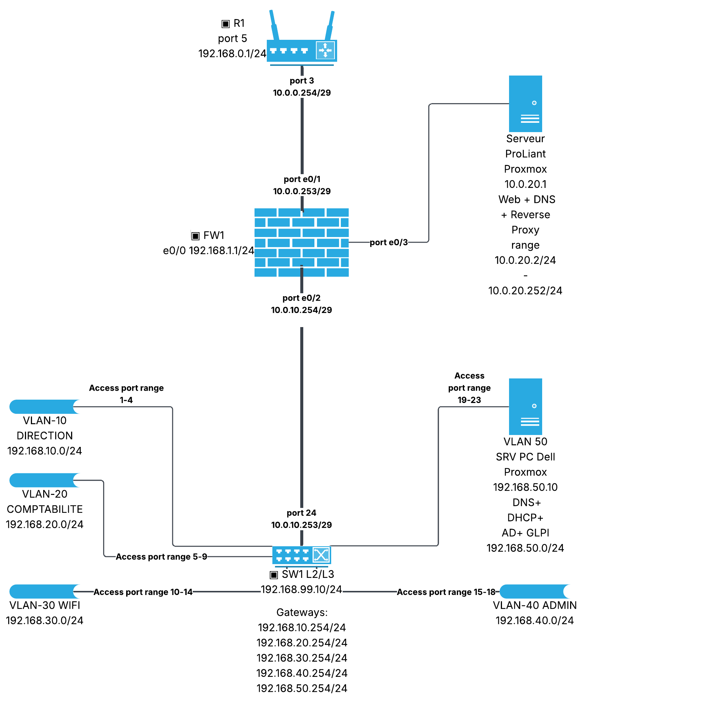

# Dossier technique du réseau

Inventaire du matériel et configuration de la nouvelle architecture

Ce dossier décrit le câblage, l’adressage, le routage et le filtrage du réseau du projet. SW1 assure le routage des cinq VLAN internes. FW1 sépare le LAN, la DMZ et le transit vers R1. Le schéma de référence est « TPAIS projet diagramme.pdf », version du 17 septembre 2026. Les configurations ci-dessous constituent le plan de mise en service ; la recette sur les équipements reste à effectuer.

## 1 Inventaire du matériel

| Qté | Équipement | Repère ou caractéristiques |
| --- | --- | --- |
| 4 | PC Dell | PC01 à PC03 clients ; PC04 serveur Proxmox interne |
| 1 | Serveur ProLiant | SRV1 - hôte Proxmox de la DMZ |
| 1 | Routeur TP-Link | R1 — modèle à relever |
| 1 | Pare-feu Hillstone | FW1 — modèle à relever |
| 1 | Switch Cisco | SW1 — routage L3 requis ; modèle à vérifier |
| 1 | Switch Zyxel | SW2 - disponible en réserve, absent de la nouvelle topologie |
| 1 | Point d’accès Wi-Fi Netis | AP1 — modèle à relever |
| 4 | Claviers | Connectique à relever |
| 3 | Souris | Connectique à relever |
| 3 | Écrans | Modèles et entrées vidéo à relever |

Trois PC sont utilisés comme postes de travail. PC04 et SRV1 sont des hôtes Proxmox. Les autres équipements ne disposent pas de périphériques attitrés (clavier, souris, écran). Le quatrième clavier reste disponible pour la maintenance.

### Câbles et alimentations

| Qté | Élément | Caractéristiques relevées |
| --- | --- | --- |
| 9 | Câbles Ethernet | Catégorie et longueur à relever |
| 3 | Câbles VGA | Liaisons vidéo |
| 1 | Câble DVI | Liaison vidéo |
| 6 | Alimentations ou cordons secteur | Mention au tableau : 10 A / 240 V ; type à vérifier |
| 1 | Bloc d’alimentation 19,5 V | Entrée 100–240 V, 2,34 A ; sortie 19,5 V, 9,23 A |
| 2 | Blocs d’alimentation 12 V | Entrée 100–240 V, 1 A ; sortie 12 V, 3 A |

Les associations entre blocs d’alimentation et appareils doivent être relevées sur les étiquettes. Les repères PC01 à PC04, SRV1 et AP1 identifient le matériel. Huit câbles Ethernet sont utilisés dans le plan actualisé ; C02 reste disponible. Un raccordement WAN de R1 peut utiliser ce câble de réserve.

## 2 Schéma du réseau

R1 port 3 rejoint directement FW1 e0/1 sur 10.0.0.248/29. FW1 e0/2 rejoint le port routé 24 de SW1 sur 10.0.10.248/29. FW1 e0/3 dessert la DMZ 10.0.20.0/24 et SRV1. SW1 conserve les passerelles des VLAN 10 à 50 ; son port 23 reste en accès VLAN 50 vers PC04.

Le schéma distingue l’hyperviseur SRV1 10.0.20.1 et les adresses de VM 10.0.20.2 à 10.0.20.252. L’adresse 10.0.20.254 est proposée pour FW1 e0/3, dont l’IP n’est pas indiquée sur le schéma. SW2 est conservé à l’inventaire mais n’est plus raccordé.

## 3 Plan des réseaux et des interfaces

Les VLAN internes et la DMZ utilisent /24 (255.255.255.0). Les deux transits utilisent /29 (255.255.255.248) : leurs réseaux commencent en .248, les hôtes utilisables vont de .249 à .254 et la diffusion est .255. Le transit R1 vers FW1 n’est plus une DMZ en /24.

### Réseaux et passerelles

| Zone | Réseau et préfixe | Passerelle ou extrémités | Ports SW1 |
| --- | --- | --- | --- |
| VLAN 10 Direction | 192.168.10.0/24 | 192.168.10.254 | 1 à 4 |
| VLAN 20 Comptabilité | 192.168.20.0/24 | 192.168.20.254 | 5 à 9 |
| VLAN 30 Wi-Fi | 192.168.30.0/24 | 192.168.30.254 | 10 à 14 |
| VLAN 40 Administration | 192.168.40.0/24 | 192.168.40.254 | 15 à 18 |
| VLAN 50 Serveurs | 192.168.50.0/24 | 192.168.50.254 | 19 à 23 |
| Transit R1 vers FW1 | 10.0.0.248/29 | R1 .254 ; FW1 .253 | Sans objet |
| Transit SW1 vers FW1 | 10.0.10.248/29 | SW1 .253 ; FW1 .254 | 24 routé |
| DMZ | 10.0.20.0/24 | FW1 10.0.20.254 proposée | Sans objet |
| VLAN 99 Gestion réservé | 192.168.99.0/24 | SW1 .10 sur le schéma ; transport absent | Aucun |
| Gestion locale R1 | 192.168.0.0/24 | R1 port 5 : 192.168.0.1 | Aucun |
| Gestion locale FW1 | 192.168.1.0/24 | FW1 e0/0 : 192.168.1.1 | Aucun |

### Interfaces des équipements

| Repère | Interface et fonction | Adresse et préfixe |
| --- | --- | --- |
| R1 | Port 3 vers FW1 e0/1 | 10.0.0.254/29 |
| FW1 | e0/1 vers R1 ; zone AMONT | 10.0.0.253/29 |
| FW1 | e0/2 vers SW1 ; zone LAN | 10.0.10.254/29 |
| FW1 | e0/3 vers SRV1 ; zone DMZ | 10.0.20.254/24 proposée |
| SW1 | Port 24 routé vers FW1 | 10.0.10.253/29 |
| SW1 | SVI des VLAN 10 à 50 | 192.168.X.254/24 ; X = 10, 20, 30, 40, 50 |
| SW1 | Gestion VLAN 99 réservée | 192.168.99.10/24 ; non activée |
| SW2 | Zyxel conservé en réserve | Aucun raccordement ni IP active |
| R1 | Port 5 ; gestion locale dédiée | 192.168.0.1/24 |
| FW1 | e0/0 ; gestion locale dédiée | 192.168.1.1/24 |

Le schéma réserve 192.168.99.10/24 à la gestion de SW1. Aucune liaison du VLAN 99 ni passerelle dédiée n’y figure : cette adresse reste inactive tant que son accès n’est pas conçu. Les anciennes réservations R1 192.168.99.10, FW1 192.168.99.11 et SW1 192.168.99.12 sont abandonnées pour éviter incohérences et doublons.

Les passerelles des VLAN 10 à 50 restent en .254. Dans la DMZ, .1 désigne SRV1, .2 à .252 sont réservées aux VM, .253 reste libre et .254 est proposée comme passerelle. Les adresses .0 et .255 du /24 ne doivent pas être attribuées à des hôtes.

## 4 Affectation des adresses et services

Les adresses des trois PC clients, d’AP1 et de PC04 sont conservées. SRV1 passe à 10.0.20.1/24 avec FW1 comme passerelle. Chaque VM utilise sa propre adresse ; les services Windows ne sont pas installés directement sur Proxmox.

| Hôte | Adresse et préfixe | Passerelle | Affectation |
| --- | --- | --- | --- |
| PC01 Dell | 192.168.10.10/24 | 192.168.10.254 | Direction |
| PC02 Dell | 192.168.20.10/24 | 192.168.20.254 | Comptabilité |
| PC03 Dell | 192.168.40.10/24 | 192.168.40.254 | Administration |
| PC04 Dell Proxmox | 192.168.50.10/24 | 192.168.50.254 | Hyperviseur interne |
| AP1 Netis | 192.168.30.2/24 | 192.168.30.254 | Point d’accès en mode pont |
| SRV1 ProLiant Proxmox | 10.0.20.1/24 | 10.0.20.254 | Hyperviseur DMZ |

### Adresses proposées pour les machines virtuelles

| VM proposée | Hébergement et services | IP fixe et passerelle |
| --- | --- | --- |
| DC01 | PC04 ; AD DS, DNS interne et DHCP | 192.168.50.20/24 ; GW 192.168.50.254 |
| GLPI01 | PC04 ; application GLPI et base locale | 192.168.50.30/24 ; GW 192.168.50.254 |
| WEB01 | SRV1 ; Web et reverse proxy sur la même VM | 10.0.20.10/24 ; GW 10.0.20.254 |
| DNSDMZ01 | SRV1 ; résolveur DNS de la DMZ et redirecteur de DC01 | 10.0.20.53/24 ; GW 10.0.20.254 |

Ces noms et adresses de VM complètent le plan et doivent être réservés avant déploiement. AD, DNS et DHCP sont regroupés sur DC01 ; GLPI dispose d’une VM distincte. WEB01 regroupe le site et le reverse proxy. DNSDMZ01 est un résolveur à accès restreint, sans publication DNS sur Internet. Le domaine AD et les noms de service seront ceux retenus lors de l’installation.

### Distribution DHCP du VLAN 30

| Paramètre | Valeur |
| --- | --- |
| Réseau et plage | 192.168.30.0/24 ; 192.168.30.100 à 192.168.30.199 |
| Masque et bail proposé | 255.255.255.0 ; 8 heures |
| Option 003 Routeur | 192.168.30.254 |
| Option 006 DNS | 192.168.50.20 |
| Serveur | DC01 192.168.50.20 ; rôle DHCP autorisé dans AD |
| Relais sur SW1 | SVI VLAN 30 ; ip helper-address 192.168.50.20 |
| Adresses hors plage | AP1 192.168.30.2 et passerelle .254 ; pas de réservation nécessaire |

Seul le VLAN 30 utilise le DHCP. AP1 fonctionne en mode pont, avec son DHCP désactivé ; la clé Wi-Fi et l’isolation des clients se règlent sur AP1. Les postes du domaine utilisent DC01 comme DNS, même en IP statique. DC01 redirige les requêtes externes vers DNSDMZ01 ; ce dernier utilise les résolveurs externes autorisés par FW1.

## 5 Plan de câblage Ethernet

Les étiquettes existantes C01 à C09 sont conservées pour faciliter le recâblage. C01 relie maintenant R1 à FW1 et C04 relie FW1 à SRV1. C02 devient le câble de réserve. Vérifier le nom système des interfaces avant d’appliquer une commande.

| Câble | Extrémité A | Extrémité B | Usage |
| --- | --- | --- | --- |
| C01 | R1 TP-Link Port 3 | FW1 Hillstone e0/1 | Transit 10.0.0.248/29 |
| C02 | Non raccordé | Réserve | Maintenance locale ou WAN si nécessaire |
| C03 | FW1 Hillstone e0/2 | SW1 Cisco Port 24 | Transit 10.0.10.248/29 |
| C04 | FW1 Hillstone e0/3 | SRV1 ProLiant Carte Ethernet reliée | DMZ 10.0.20.0/24 |
| C05 | SW1 Cisco Port 1 | PC01 Dell Interface Ethernet | Accès VLAN 10 |
| C06 | SW1 Cisco Port 5 | PC02 Dell Interface Ethernet | Accès VLAN 20 |
| C07 | SW1 Cisco Port 15 | PC03 Dell Interface Ethernet | Accès VLAN 40 |
| C08 | SW1 Cisco Port 10 | AP1 Netis Port LAN | Accès VLAN 30 |
| C09 | SW1 Cisco Port 23 | PC04 Dell Proxmox Carte Ethernet reliée | Accès VLAN 50 |

### Raccordement des hyperviseurs

Le port 23 de SW1 est en accès VLAN 50. PC04 et ses VM communiquent sur ce VLAN sans étiquette 802.1Q sur le câble C09. Le pont réseau Proxmox relie leurs interfaces virtuelles à la carte physique. Aucun trunk n’est nécessaire tant que ce lien ne transporte qu’un VLAN.

Sur SRV1, C04 relie directement la carte physique au port e0/3 de FW1. Le pont Proxmox et les VM utilisent la DMZ non étiquetée 10.0.20.0/24. SRV1 et chaque VM ont pour passerelle 10.0.20.254. Aucune route de VM vers 10.0.0.253 n’est nécessaire ; cette adresse n’est pas sur leur réseau local.

Les ports de SW2 ne sont plus utilisés. Le port 3 de R1 doit appartenir au réseau de transit /29 et être isolé de tout autre LAN ou Wi-Fi non prévu. Les capacités du TP-Link à appliquer ce masque, les routes et le NAT doivent être contrôlées.

## 6 Répartition des ports et besoins matériels

### Ports du switch Cisco SW1

| Ports | Mode | VLAN | Affectation |
| --- | --- | --- | --- |
| 1 à 4 | Accès | 10 | 1 : PC01 ; 2 à 4 libres |
| 5 à 9 | Accès | 20 | 5 : PC02 ; 6 à 9 libres |
| 10 à 14 | Accès | 30 | 10 : AP1 ; 11 à 14 libres |
| 15 à 18 | Accès | 40 | 15 : PC03 ; 16 à 18 libres |
| 19 à 23 | Accès | 50 | 23 : PC04 ; 19 à 22 libres |
| 24 | Routé L3 | Sans objet | FW1 e0/2 ; SW1 10.0.10.253/29 |

### État du switch Zyxel SW2

| Équipement | État | Consigne |
| --- | --- | --- |
| SW2 Zyxel | En réserve, non raccordé | Aucune configuration requise dans cette architecture ; conserver sa configuration sauvegardée. |

Le retrait de SW2 place le serveur DMZ derrière FW1. Les échanges entre DMZ et amont passent désormais par le pare-feu. Les VM partageant un même pont Proxmox restent dans le même domaine L2 ; leurs échanges locaux nécessitent le pare-feu des hôtes ou de Proxmox.

### Gestion des équipements

Le VLAN 99 reste réservé à la gestion de SW1 avec l’adresse du schéma 192.168.99.10/24. Aucun port d’accès, trunk, SVI opérationnelle ni route vers ce réseau n’est activé dans la configuration de base. Le lien routé C03 ne transporte pas de VLAN 99 étiqueté.

Le dernier schéma ajoute R1 port 5 à 192.168.0.1/24 et FW1 e0/0 à 192.168.1.1/24 pour la gestion locale. Aucun câble permanent ni route vers ces réseaux n’est représenté. PC03 utilise temporairement une liaison directe et une adresse du réseau concerné, comme décrit à la section 8. Depuis le VLAN 40, SW1 reste administrable via 192.168.40.254 ; l’accès à FW1 10.0.10.254 et R1 10.0.0.254 est une possibilité complémentaire à autoriser explicitement.

### Bilan matériel

Le plan utilise huit câbles sur les neuf disponibles. C02 reste en réserve ou peut servir au WAN de R1 si nécessaire. Les trois écrans et trois souris sont affectés aux trois postes clients ; le quatrième clavier reste disponible pour la maintenance.

Relever avant installation les modèles, versions, capacités L3 de SW1, noms réels d’interfaces, longueurs des câbles et associations d’alimentation. SW1 doit prendre en charge le routage IP, les SVI, le port routé, le relais DHCP et les ACL. La mention 10 A / 240 V ne suffit pas à identifier une alimentation compatible.

## 7 Routage et filtrage

### Routes statiques et routes par défaut

| Équipement | Destination | Prochain saut |
| --- | --- | --- |
| SW1 | 0.0.0.0/0 | 10.0.10.254 |
| FW1 | 192.168.10.0/24 ; 192.168.20.0/24 192.168.30.0/24 ; 192.168.40.0/24 192.168.50.0/24 | 10.0.10.253 |
| FW1 | 0.0.0.0/0 | 10.0.0.254 |
| R1 | Les cinq /24 internes ci-dessus 10.0.10.248/29 ; 10.0.20.0/24 | 10.0.0.253 |
| R1 | 0.0.0.0/0 | Passerelle WAN fournie par le réseau amont |
| SRV1 et chaque VM DMZ | 0.0.0.0/0 | 10.0.20.254 |
| PC04 et VM internes | 0.0.0.0/0 | 192.168.50.254 |

Les réseaux directement connectés à FW1 sont 10.0.0.248/29, 10.0.10.248/29 et 10.0.20.0/24. Les cinq VLAN sont directement connectés à SW1. Aucun équipement n’annonce de route vers le VLAN 99 réservé. Les routes de retour sur R1 restent nécessaires dans le mode NAT retenu ci-dessous.

### Traduction des adresses et publication

Le mode de référence place le NAT de sortie sur R1, vers son interface WAN, pour les cinq VLAN internes et la DMZ. FW1 ne traduit pas les échanges LAN vers DMZ. Si le TP-Link ne traduit pas les réseaux routés, utiliser un SNAT sur FW1 uniquement en sortie e0/1, suivi du NAT de R1 ; documenter alors ce double NAT et ses limites pour la visibilité des sources. Ne pas activer les deux variantes sans vérifier les règles.

Aucune publication WAN n’est activée par défaut. Une publication Web ultérieure nécessite une adresse WAN joignable, un DNAT TCP 80/443 sur R1 vers 10.0.0.253, puis sur FW1 vers WEB01 10.0.20.10 et une règle AMONT vers DMZ limitée à ces ports. Ne pas publier les hyperviseurs, AD, GLPI ou un résolveur DNS récursif.

### Services autorisés

| Groupe | Protocoles et ports de destination |
| --- | --- |
| DNS | UDP et TCP 53 |
| AD_CLIENT | TCP 88, 135, 389, 445, 464, 3268, 49152 à 65535 ; UDP 88, 123, 389, 464 ; DNS ; ICMP vers DC01 |
| WEB | TCP 80 et 443 ; GLPI utilise TCP 443 |
| ADMIN | TCP 22, 443 et 8006 pour les hyperviseurs et équipements selon service ; TCP 3389, 5986 et 9389 vers DC01 ; ICMP de diagnostic |
| DHCP | Client UDP 68 vers serveur UDP 67 ; relais UDP 67 vers serveur UDP 67 ; réponses en sens inverse |
| NTP | UDP 123 ; clients du domaine vers DC01 |

AD_CLIENT correspond aux postes membres d’un domaine Windows récent avec un contrôleur de domaine. Ajouter TCP 636 ou 3269 seulement si LDAPS est effectivement déployé ; les communications entre contrôleurs et les anciens protocoles NetBIOS ne sont pas présumés. Les ports dynamiques RPC doivent être vérifiés selon la version et la politique Windows.

### Filtrage sur SW1

Les ACL s’appliquent en entrée des interfaces VLAN 10, 20, 30, 40 et 50. SW1 route directement les échanges entre VLAN : FW1 ne les inspecte pas. La première règle correspondante décide du résultat. Placer les exceptions avant les refus de réseaux privés et le refus général en dernier ; un « deny any » placé en tête bloquerait toutes les autorisations suivantes.

| Ordre | Source | Destination | Service et action |
| --- | --- | --- | --- |
| 10 | Clients Wi-Fi et relais SW1 | DC01 et diffusion DHCP | Autoriser DHCP, y compris attribution initiale et renouvellement |
| 20 | VLAN 10, 20, 30 et PC03 | DC01 192.168.50.20 | Autoriser DNS ; Wi-Fi limité à ce service interne |
| 30 | VLAN 10, 20 et PC03 | DC01 192.168.50.20 | Autoriser AD_CLIENT |
| 40 | VLAN 10, 20 et PC03 | GLPI01 192.168.50.30 | Autoriser HTTPS TCP 443 |
| 50 | PC03 192.168.40.10 | Équipements, hyperviseurs et VM | Autoriser ADMIN aux seules adresses inventoriées |
| 60 | VLAN 10, 20 et PC03 | WEB01 10.0.20.10 | Autoriser WEB ; décision DMZ finale sur FW1 |
| 70 | DC01 | DNSDMZ01 10.0.20.53 | Autoriser DNS ; redirection des noms externes |
| 80 | Serveurs et postes administrés | Clients autorisés et PC03 | Autoriser les retours des flux précédents selon protocole |
| 90 | Hôtes de chaque VLAN | Leur propre passerelle | Autoriser ICMP de diagnostic |
| 100 | Chaque VLAN | Autres réseaux privés | Refuser les autres échanges ; journaliser |
| 110 | VLAN 10, 20, 30 et PC03 ; PC04, DC01, GLPI01 | Internet via FW1 | Autoriser WEB ; DC01 et PC04 peuvent utiliser NTP vers la source approuvée |
| 999 | Toute source | Toute destination | Refuser et journaliser le reste |

Politique proposée : Direction et Comptabilité accèdent au domaine, à GLPI et au Web ; le Wi-Fi est isolé des autres VLAN et de la DMZ, avec uniquement DNS, DHCP et Web vers Internet. PC03 est le poste d’administration. Les communications entre machines d’un même VLAN ne traversent pas les SVI : activer les pare-feu locaux et l’isolation Wi-Fi pour ce périmètre.

Les ACL IOS statiques ne suivent pas les sessions. La règle de retour doit être traduite en autorisations inverses TCP, UDP et ICMP : TCP established vérifie les indicateurs ACK/RST, sans constituer un pare-feu à états. Prévoir les réponses DNS, AD, DHCP et NTP, les réponses ICMP et les erreurs ICMP nécessaires. Valider les ACL par sens avec leurs compteurs. Le guide contient un exemple complet pour le VLAN 30 ; la matrice couvre les cinq VLAN.

### Filtrage sur FW1

Affecter trois zones distinctes : AMONT sur e0/1, LAN sur e0/2 et DMZ sur e0/3. Le tableau décrit des règles à créer et ordonner dans StoneOS, avec suivi de session. « Internet » exclut les réseaux privés 10.0.0.0/8, 172.16.0.0/12 et 192.168.0.0/16. Définir les objets de résolveurs et de serveurs NTP avec les adresses réellement autorisées.

| Ordre | Zone source et hôtes | Zone destination et hôtes | Service et action |
| --- | --- | --- | --- |
| 10 | Sessions déjà autorisées | Sens retour | Accepter les retours par suivi de session ; traiter les erreurs ICMP associées |
| 20 | LAN ; PC03 | DMZ ; SRV1, WEB01, DNSDMZ01 | Autoriser ADMIN selon le service de chaque hôte |
| 30 | LAN ; VLAN 10, 20 et PC03 | DMZ ; WEB01 10.0.20.10 | Autoriser TCP 80 et 443 |
| 40 | LAN ; DC01 192.168.50.20 | DMZ ; DNSDMZ01 10.0.20.53 | Autoriser UDP et TCP 53 |
| 50 | DMZ ; toute source | LAN ; tous les VLAN | Refuser toute nouvelle session ; journaliser |
| 60 | LAN ; PC03 | AMONT ; R1 10.0.0.254 | Autoriser HTTPS ou SSH si disponible, et ICMP |
| 70 | LAN et DMZ ; toute autre source | AMONT ; réseaux privés | Refuser ; empêcher les contournements par une règle Internet large |
| 80 | LAN ; hôtes autorisés par SW1 | AMONT ; Internet | Autoriser TCP 80 et 443 |
| 90 | DMZ ; SRV1, WEB01, DNSDMZ01 | AMONT ; Internet | Autoriser TCP 80 et 443 pour mises à jour |
| 100 | DMZ ; DNSDMZ01 | AMONT ; résolveurs externes approuvés | Autoriser UDP et TCP 53 uniquement |
| 110 | LAN ; DC01 et PC04 ; DMZ ; SRV1, WEB01, DNSDMZ01 | AMONT ; serveurs NTP approuvés | Autoriser UDP 123 |
| 999 | Toutes zones | Toutes destinations | Refuser et journaliser ; aucune publication WAN active |

L’administration locale de FW1 se règle séparément : accès dédié par e0/0 à 192.168.1.1 depuis le poste de maintenance 192.168.1.10, et accès complémentaire par e0/2 depuis PC03 192.168.40.10 uniquement si activé. Utiliser HTTPS ou SSH selon les fonctions disponibles. Ne pas autoriser de transit via le réseau de gestion. Le DNS de DMZ accepte la récursion uniquement depuis DC01 et les hôtes DMZ inventoriés. Les nouvelles connexions DMZ vers LAN restent interdites ; les retours des sessions initiées depuis le LAN restent autorisés.

### Filtrage sur R1

Le tableau suivant décrit la politique à saisir dans l’interface du TP-Link selon son modèle. Les commandes Cisco IOS ne s’appliquent pas automatiquement à R1. Les accès locaux d’administration et le trafic traversant R1 sont deux réglages distincts.

| Ordre | Source | Destination | Service et action |
| --- | --- | --- | --- |
| 10 | Sessions sortantes autorisées | Sens retour | Accepter par suivi de session |
| 20 | PC03 192.168.40.10 | R1 10.0.0.254 | Autoriser administration HTTPS ou SSH si disponible et ICMP |
| 25 | PC03 en maintenance 192.168.0.10 | R1 port 5 ; 192.168.0.1 | Autoriser administration locale ; aucun routage vers les autres zones |
| 30 | LAN et DMZ via FW1 ; ou FW1 .253 en mode double NAT | WAN | Autoriser les flux sortants déjà filtrés par FW1 et effectuer le NAT WAN |
| 40 | WAN | Réseaux internes, DMZ et transit | Refuser toute nouvelle connexion ; journaliser |
| 999 | Toute autre source | Administration de R1 | Refuser ; désactiver administration WAN et ouvertures automatiques UPnP |

## 8 Mise en service et exploitation

1. Sauvegarder les configurations de R1, FW1, SW1 et Proxmox. Relever les modèles et versions. Prévoir un accès console et vérifier que les fonctions nécessaires sont disponibles.

2. Recâbler C01 et C04, retirer SW2 du chemin, puis configurer les deux transits /29 et la DMZ. Vérifier chaque voisin directement connecté avant de modifier le routage.

3. Configurer les VLAN, les ports d’accès, les SVI et les routes. Créer les ponts Proxmox sans étiquette VLAN sur C04 et C09 ; réserver les IP de VM et vérifier leur unicité.

4. Déployer DC01, GLPI01, WEB01 et DNSDMZ01. Définir le domaine AD, les enregistrements DNS, les certificats et les redirecteurs. Installer et autoriser le rôle DHCP, créer l’étendue et le relais VLAN 30.

5. Créer les objets et les règles de filtrage. Sur SW1, appliquer les ACL une interface à la fois avec console disponible ; tester les retours. Sur FW1, conserver des zones distinctes et activer la journalisation des refus.

6. Configurer le NAT retenu sur R1, effectuer la recette positive et négative, puis sauvegarder les configurations validées. Ne jamais remplacer un échec de filtrage par une autorisation globale permanente.

### Accès local aux interfaces de gestion

La gestion dédiée du dernier schéma utilise deux réseaux distincts, sans passerelle de poste ni route publiée dans le LAN. Pour administrer R1, débrancher temporairement PC03 du VLAN 40, le raccorder au port 5 de R1 et utiliser 192.168.0.10/24, sans passerelle. Pour FW1, raccorder PC03 à e0/0 et utiliser 192.168.1.10/24, sans passerelle. Vérifier que ces adresses de poste sont libres avant utilisation. Ne pas relier les deux réseaux de gestion entre eux ni les ponter au LAN.

Après maintenance, remettre PC03 sur C07 vers SW1 port 15, restaurer 192.168.40.10/24, passerelle 192.168.40.254 et DNS 192.168.50.20. C02 peut servir à une intervention locale lorsqu’il est disponible ; sinon, réutiliser le câble de PC03. Un raccordement permanent simultané des interfaces de gestion demanderait du matériel et un plan supplémentaires. Les huit liens de production restent ceux de la section 5.

### Sauvegardes et retour arrière

Conserver hors des équipements les exports de configuration et les sauvegardes des VM, avec date, version et test de restauration. Un snapshot seul ne remplace pas une sauvegarde. Contrôler les journaux de refus, les erreurs de ports, l’espace de stockage et les baux DHCP après la mise en service.

En cas de perte d’accès après une ACL, retirer cette ACL de l’interface depuis la console, rétablir la configuration précédente puis vérifier les routes et le DNS. Pour un échec de migration, restaurer les adresses et configurations sauvegardées ainsi que le câblage correspondant. Ne sauvegarder définitivement les nouveaux réglages qu’après la recette.

## 9 Plan de recette

Ce tableau présente les résultats attendus. Les tests n’ont pas été exécutés sur le réseau dans le cadre de cette mise à jour documentaire. Pour chaque contrôle, conserver la date, le poste source, la commande ou capture, le résultat observé et l’éventuelle correction.

| Contrôle | Vérification | Résultat attendu |
| --- | --- | --- |
| Interfaces et câbles | Comparer ports, VLAN, masques et voisins aux tableaux | 8 liens actifs ; C02 en réserve ; pas de SW2 en transit |
| Liaisons routées | SW1 vers 10.0.10.254 ; FW1 vers 10.0.0.254 et 10.0.20.1 | Voisins joignables avec diagnostics autorisés |
| Routage retour | Vérifier les routes de R1 et FW1 ; tracer PC03 vers SRV1 | Passage SW1 puis FW1 ; pas de retour direct SRV1 vers R1 |
| DHCP Wi-Fi | Libérer puis renouveler le bail sur un client VLAN 30 | IP .100 à .199 ; masque /24 ; GW .254 ; DNS 192.168.50.20 |
| DNS | Résoudre les noms internes puis un nom Internet via DC01 | DC01 répond ; noms externes transmis à DNSDMZ01 |
| Domaine | Joindre un poste VLAN 10 puis VLAN 20 ; ouvrir une session et appliquer une GPO | DNS, Kerberos, LDAP, SMB et RPC fonctionnent |
| Applications | Depuis PC01 et PC02, ouvrir GLPI en HTTPS et WEB01 | Services accessibles ; certificats et noms cohérents |
| Administration | PC03 vers Proxmox TCP 8006 et équipements ; répéter depuis PC01 | PC03 autorisé ; PC01 refusé pour administration |
| Gestion locale | PC03 branché successivement à R1 port 5 puis FW1 e0/0 | Accès à 192.168.0.1 puis 192.168.1.1 avec IP locale adaptée ; retour au VLAN 40 vérifié |
| Isolation Wi-Fi | VLAN 30 vers PC01, GLPI01, Proxmox et WEB01 ; puis DNS et Internet | Accès privés refusés hors DNS et DHCP ; WEB Internet autorisé |
| Isolation DMZ | WEB01 vers DC01 TCP 445 et PC03 TCP 3389 | Nouvelles connexions refusées par FW1 et journalisées |
| Internet et NAT | Accès HTTPS depuis un poste LAN et WEB01 ; observer sessions et traduction | Sortie et retours valides ; pas de NAT LAN vers DMZ |
| Persistance | Sauvegarder, redémarrer selon fenêtre de maintenance, refaire les tests essentiels | Configuration conservée ; résultats datés dans le compte rendu de recette |

## 10 Informations à relever avant déploiement

Le plan d’adressage et la politique proposée sont complets pour la maquette. Les informations suivantes dépendent du matériel et de l’environnement : modèle et version de R1, FW1 et SW1 ; nom des interfaces ; prise en charge du NAT des sous-réseaux sur R1 ; connexion WAN et passerelle ; domaine AD ; noms DNS et certificats ; résolveurs et sources NTP autorisés ; mode de sécurité Wi-Fi et stockage des sauvegardes. Ces paramètres doivent être relevés lors de la préparation, sans leur attribuer de valeurs fictives.

Le choix de 10.0.20.254 pour e0/3, les IP et noms des VM et la politique d’isolation sont des propositions de mise en service. Le VLAN 99 reste une extension à concevoir : aucune disponibilité de 192.168.99.10 n’est attendue avant son raccordement. L’adressage IPv6 et son filtrage doivent faire l’objet d’un plan séparé si IPv6 est utilisé ; les ACL présentées ici concernent IPv4.

### Références techniques

Schéma du projet : TPAIS projet diagramme.pdf ; commit 743c5c2 du 17 septembre 2026, intégré à main par 8476785.

Sources techniques : [Cisco ACL](https://www.cisco.com/c/en/us/support/docs/ip/access-lists/26448-ACLsamples.html) ; [Cisco relais DHCP](https://www.cisco.com/c/en/us/td/docs/ios-xml/ios/ipaddr_dhcp/configuration/xe-16-11/dhcp-xe-16-11-book/dhcp-relay-agent-xe.html) ; [Microsoft AD](https://learn.microsoft.com/en-us/troubleshoot/windows-server/active-directory/config-firewall-for-ad-domains-and-trusts) ; [Proxmox réseau](https://pve.proxmox.com/wiki/Network_Configuration) ; [Hillstone StoneOS](https://kb.hillstonenet.com/en/wp-content/uploads/2020/10/StoneOS-Cookbook-V9.pdf)
